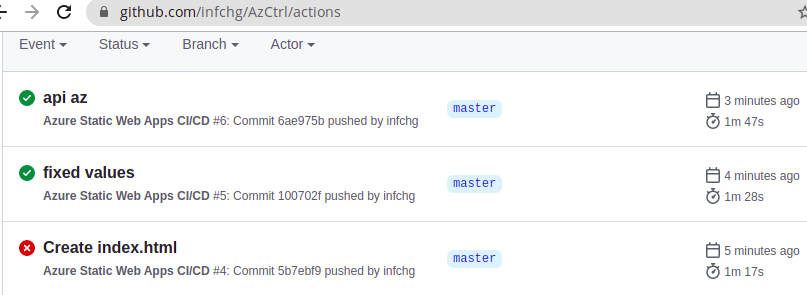

# Creating iCLEA repository of Cloud Easy Appliances

As in the furniture home model: iCLEA templates ready to deploy and build new Clouds quickly and cost effectively. 

Here business can pickup appliances for AWS, Azure, GCP, ... 
 - 2022 Sept 17 uploading new Azure & AWS demo templates
 - tf

## AzCtrl AZURE CLOUD CONTROL DEMOS

We review tools to control several AD FS and AD DS in Azure,As a parallel task to

This page has temporary notes shared during presentation and workships, covering As a parallel task:

- Az AD DS setup and connectivity
- Oath OIDS SAML
- automate with Az cli, for demo we start with a simple app we are going to control:
- automate with az cmdlet powershell

## Az-AD-DS

In Azure portal, chose Azure Active Directory and go to App registrations :

  - get Client ID. 
  - To get Client secret to go to Certificates & secrets - generate new  

We check from powershell inside azure:

      Test-Connection -ComputerName 10.1.0.4 -Count 3
      
Test-Connection -ComputerName 10.1.0.4 -Count 3| Select-Object -Property Source  # (10.244.51.183)

Source|
------|
cc-c735a499-545db545c8-p64w9|

 
## App py

https://portal.azure.com and by choosing “Web Apps” -> “Create app service” 

## Az-cli

Example of commands (notes from the presentation and dissemination labs to be compiled here soon)

az storage account create     -g web -n st1web -l 'Central US' # create StorageV2

      {
        "accessTier": "Hot",
        "allowBlobPublicAccess": true,
        "allowCrossTenantReplication": null,

 Azure needs a  special container called $web, which is the only container of each Azure Blob Storage. 

       az storage container create -n '$web' --account-name st1web # recommended to use other like --sas-token with credentials.
       {
         "created": true
       }

az storage blob upload-batch -s ./tmp/  -d \$web --account-name st1web  # for automation check --auth-mode   --sas-token   credentials.

 
      Finished[#############################################################]  100.0000%
      [
        {
          "Blob": "https://st1web.blob.core.windows.net/$web/index.html",
          "Last Modified": "2022-02-09T13:35:47+00:00",
          "Type": "text/html",
          "eTag": "\"0x8D9EBD114461E8D\""
        }
      ]

az storage account show -n st1web -g web --query "primaryEndpoints.web" --output tsv

      https://st1web.z19.web.core.windows.net/   # before setup should give ErrorCode: WebsiteDisabled

To Configure it 

      az storage blob service-properties update --account-name st1web  --static-website --index-document index.html  #optional --404-document error.html 

And we have a basic wen, could setup CORS and logging later

### Or sync on github AzDevOps ...:

could start new one:

    az staticwebapp create     --name app2     --resource-group web     --source https://github.com/infchg/AzCtrl     --location "eastus2"     --login-with-github
    #    --branch main     --app-location "src" 

or modify existing web app:

     az staticwebapp update -n app --source  https://github.com/infchg/AzCtrl   -b master --token    GithubRepoAccessToken
    az staticwebapp update -n app -s https://github.com/infchg/AzCtrl -b master --tags "py=3.8 api=7" -t GithubRepoAccessToken
     {
    "allowConfigFileUpdates": true,
    "branch": "master",
    "buildProperties": null,
    "contentDistributionEndpoint": "https://content-dm1.infrastructure.1.azurestaticapps.net",
    "customDomains": [],
    "defaultHostname": "orange-water-019139410.1.azurestaticapps.net",

After this az command, 
Azure will use the token to create pipeline actions in your repo. Beware sometimes azure leave two values empty and the action breaks, a solution is to edit your yaml action and fix this:
	
	      api_location: "api" # Api source code path - optional
          output_location: "WebSite" # Built app content directory 

  

Once fixed you see the website updated in azure:
	
	az staticwebapp environment show -n  App  --output table
	
BuildId   | CreatedTimeUtc              Hostname                                      LastUpdatedOn               Location    Name     ResourceGroup    SourceBranch    Status
---------|  --------------------------  --------------------------------------------  --------------------------  ----------  -------  ---------------  --------------  ---------
default   | 2022-02-09T01:08:43.394400  orange-water-019139410.1.azurestaticapps.net  2022-02-09T19:43:03.040164  Central US  default  web              master          Uploading

## Further Reading

- Microsoft, (2022), Troubleshooting & Limitations of Azure Cloud Shell, AzureAD.Standard.Preview, https://docs.microsoft.com/en-us/azure/cloud-shell/troubleshooting
- Microsoft, (2021), Quickstart: Building your first static site using the Azure CLI https://docs.microsoft.com/en-us/azure/static-web-apps/get-started-cli?tabs=vanilla-javascript
- Marcello Marrocos (2020) Static WebSite on Azure Storage Account https://medium.com/devops-cloud-it-career/static-website-on-azure-storage-account-17887938debb who also mentioned Github acquisition by Ms in 2018

## Control Dashboards

# Lean-Quality Dashboards tools

some dashboards and splunk controls from 2019 reorganized outside

##  Open-Source for The Field and Non-Profit use

### OLDER <2015

#### Beluga Information-Change coding language  
 
 
the google cloud URLs  are no longer reacheable, Since the Beluga service was moved to other cloud servers, 
  - backlog:  the urls to be updated with the correct servers apps on GC & AWS
